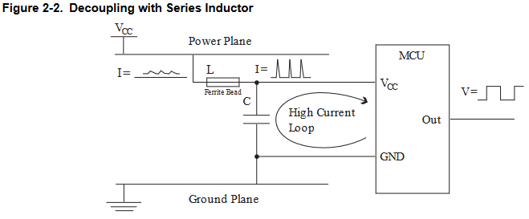

## **19 Juni 2023**  
initial project, 
make electronic design for Simple high voltage AC controller with SSR and avr (ATMega16). use [Mighty Core](https://github.com/MCUdude/MightyCore).   
**GOAL**
  1. device can control delivered power of AC voltage, controlled by AVR ATMega16
  2. add simple tft/oled display to device
  3. add input to uC
  4. add USB-Serial to device, 
  5. if posible, manufacture design with PCB factory service
  6. and so on...
## **20 Juni 2023**  
learn about recomended _hardware design consideration AVR by ATMEL_.

**POWER SUPPLY**
- in avr there 2 power supply: digital and analog, for digital supply, avr will draw just few miliamps for each clock, each clock will draw current and make spike current, the more I/O used at eachtime more spike current will drawn by device. so if power is delivered with long distance, there need to add inductor (ferrite bead) for prevent down. atmel was give recomended schematic for that.

- second power supply is for analog supply _AVCC_. analog supply need to give diference power from digital supply for ensure not affected by noise on digital power

**External Switch Reset**
- reset pin on AVR microcontroller is active low, so we can add switch from ground to reset pin. here recomended schematic from atmel.

**Programmer and Debugger**
AVR microcontroller can programmed with one or more method based on device. here some little summary.
    1. ISP or In-System Programming over SPI(Serial Peripheral Interface), use standard SPI MISO, MOSI, SCK, and Reset. there was 2 diference connector of SPI, 6 and 10 pin connector, here is connector image.
[ISP connector](fig4_ISPConncetor.png)
    2. few device can be programmed with JTAG interface. following figure show standard JTAG connector. 
[JTAG Connector](fig5_JTAGConnector.png)
    3. PDI interface
    4. TPI interface
    5. UPDI interface

**CRYSTAL AND CERAMIC RESONATOR**

`Made With Love :hearts: By AH`
